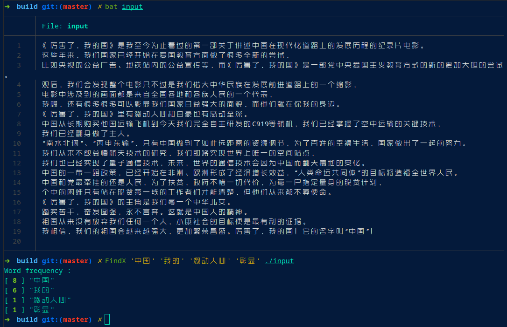

# FindX
>    A multi - mode matching software based on binary dictionary tree.


*   install :  

```bash
make clean 
make 
make install 
```

*   uninstall : 

```bash
make uninstall 
```

*   使用展示：

    

*   技术说明：

    1.  字符串编码（二进制码）
    2.  字典树二叉化、线索化，建立失败指针
    3.  